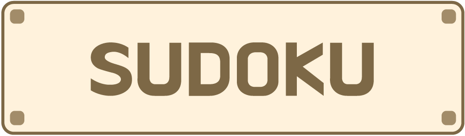

<div align="center">
  <a href="https://github.com/athenacheng15/sudoku">
    
  </a>

  <h3 align="center">SUDOKU</h3>

  <p align="center">
    This is an interactive Sudoku game designed to provide challenge and entertainment. Users can choose from different difficulty levels, ensuring the game is appealing to both beginners and advanced players. The game also features a timer to add to the challenge, pushing players to try to beat their own best times.
    <br/>
    <br/>
    <a href="https://sudoku-yu.vercel.app/">View Website</a>
    .
    <a href="https://github.com/athenacheng15/sudoku/issues">Report Bug</a>
    .
    <a href="https://github.com/athenacheng15/sudoku/issues">Request Feature</a>
  </p>
</div>
<hr>

 ## 💡 Key Features
* **Difficulty Selection**: Users can choose from multiple levels, adapting the game to their skill level.
* **Real-time Error Alerts**: The game alerts players immediately if they place duplicate numbers in any row, column, or block.
* **Timer**: Keeps track of how long the player has been solving the current puzzle.
* **Game Interruption Handling**: Confirmation prompts for actions like reloading or quitting the game ensure that progress isn’t lost inadvertently.
* **Number Highlighting**: Click a number to highlight it everywhere on the board, making it easier to spot.
* **Completion Page**: After finishing the puzzle, get automatically taken to a page that shows how tough it was and how long it took.


 ## 🛠 Tech Stack 

  
  


## 📖 Libraries
*   **NextAuth.js** : add authentication to project for various login methods.
*   **Next Cloudinary**：uploading, storage, optimization, and delivery of images
*   **Zustand** : Simplify global state management in React applications with a minimalistic API.


## 🔮 Contributing

* If you have suggestions for adding or removing projects, feel free to [open an issue](https://github.com/athenacheng15/sudoku/issues/new) to discuss it, or directly create a pull request after you edit the *README.md* file with necessary changes.
* Please make sure you check your spelling and grammar.
* Create individual PR for each suggestion.
* This is a [React.js](https://reactjs.org/) project bootstrapped with [`create-react-app`](https://github.com/vercel/next.js/tree/canary/packages/create-next-app).


### Install packages:
```bash
npm i
```

### Run the development server:
```bash
npm run start
```

Open [http://localhost:3000](http://localhost:3000) with your browser to see the result.

### Creating A Pull Request

1. Fork the Project
2. Create your Feature Branch (`git checkout -b feature/AmazingFeature`)
3. Commit your Changes (`git commit -m 'Add some AmazingFeature'`)
4. Push to the Branch (`git push origin feature/AmazingFeature`)
5. Open a Pull Request

<h2 align="left">🔍&nbsp Connect With Me :</h2>
<div align="left">
  <a href="https://www.linkedin.com/in/yuchuncheng-athena/" target="_blank">
    
  </a>
  
  
</div>
